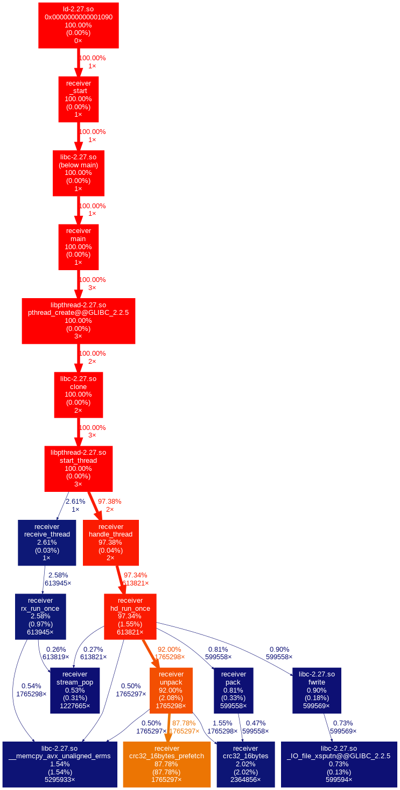

# TRTP2

This is an implementation of a file receiver based on the TRTP protocol for the LINGI1341 course taught at UCLouvain in Belgium. It is a full C implementation written for a project during the semester. It is capable of handling well in excess of a million packets per second. Since the end of the project (November 2019) we still come back from time to time to tweak little things and improve performance where necessary. The code is built with `-Wpedantic` flag to ensure relatively clean code.

Final grade : **full mark (20/20)**
Here was the comment of the TA on the project :

> Très bonne implémentation. Les choix posés sont bien expliqués et pertinents. Les expériences rapportées appuies bien ceux-ci. La suite de tests couvre bien l'implémentation. Des tests démarrant votre receiver et le sender de référence dans une série de réseaux différents auraient été un plus. Félicitations.

Translated to English it is :

> Very good implementation. The decisions made are well explained and relevant. The experiments validates those (decisions). The test suite covers the implementation well. (Automated) Tests running the final receiver using the reference implementation on multiple networks would've been a plus. Congratulations.

## Authors

| Name                                 | NOMA           |
|--------------------------------------|----------------|
| <h3>Sébastien d'Herbais de Thun</h3> | **2875-16-00** |
| <h3>Thomas Heuschling</h3>           | **2887-16-00** |

## Project structure

- `base/`       - the base implementation, instructions, etc. for the project
- `bin/`        - the binary output files, normally empty, cleaned using `make clean`
- `headers/`    - header definitions for the project
- `lib/`        - faster CRC32 implementation (instead of ZLIB)
- `report/`     - contains the LateX source code and resources for the report
- `src/`        - contains the C source code of the project, `src/main.c` is the main function
- `tests/`      - contains test definitions, best ran using `make clean && make test`
- `gitlog.stat` - required `git log --stat` output, generated using `make stat`
- `Makefile`    - the make file
- `README.md`   - informations about the project for the code review
- `rapport.pdf` - the required report in PDF format, generated using `make report` (note that it is exclusively in French)
- `setup.sh`    - used during testing to create a RAM disk for performance testing

## Makefile

- `all`: cleans and builds the code
- `build`: builds the code
- `test_build`: builds the debug version
- `release`: builds are release version (max optimization, no debug symbol)
- `clang`: builds using clang, slightly better performance the the tested GCC, but marginal
- `run`: run the release version (**does not build**)
- `test`: builds & tests the code
- `clean`: deletes all build artifacts
- `stat`: generates gitlog.stat
- `install_tectonic`: installs the report builder, requires [cargo/rust](https://rust-lang.org)
- `report`: uses tectonic to build a PDF version (can take a **long** time the first time)
- `valgrind`: runs valgrind on the final executable
- `helgrind`: runs helgrind on the final executable
- `memcheck`: runs memcheck on the final executable
- `callgrind`: runs callgrind in order to generate a callgraph.
- `plot`: plots the callgraph into `callgraph.png`, requires python2 and graphviz
- `debug`: builds a version with debug symbols and no optimization
- `tcpdump`: runs tcpdumb to get a UDP network trace
- `archive`: cleans, build the report and pack the final archive that had to be submitted for the project

## Command line arguments

Here is the printed usage for the application :

```
1 milion packets per second capable TRTP receiver

Usage:
  ./bin/receiver [options] <ip> <port>

Options:
  -m  Max. number of connection   [default: 100]
  -o  Output file format          [default: %d]
  -s  Enables sequential mode     [default: false]
  -N  Number of receiver threads  [default: 1]
  -n  Number of handler threads   [default: 2]
  -W  Maximum receive buffer      [default: 31]
  -w  Maximum window size         [default: 31]

Sequential:
  In sequential mode, only a single thread (the main thread) is used
  for the entire receiver. This means the parameters n & N will be
  ignored. Affinities are also ignored.
  Sequential mode comes with a huge performance penalty as the different
  components are ran sequentially while being designed for multithreaded use.

  /!\ You can expect about half the speed using sequential mode.

Affinities:
  Affinities are set using a affinity.cfg file in the
  working directory. This file should be formatted like this:
        comma separated affinity for each receiver. Count must match N
        comma separated affinity for each handler. Count must match n
  Here is an example file: (remove the tabs)
        0,1
        2,3,4,5
  It means the affinities of the receivers will be on CPU 0 & 1
  And the affinities of the handlers will be on CPU 2, 3, 4 & 5
  To learn more about affinity: https://en.wikipedia.org/wiki/Processor_affinity

Streams:
  Streams are used for communication between the receivers and the
  handlers. Since they're semi locking to void races, they lock
  on reading (dequeue). This means that too many handlers wil
  significantly slow down the stream. For this reason, a special
  streams.cfg allows custom mapping between receivers and handlers.
  Here is the file structure: 
        list of comma separated receivers : list of comma separated handlers
  Each line defines a new stream. Each handler and/or receiver must be used
  once and only one. Here is an example where two receivers have their own streams
        0:0,1
        1:2,3
  And one where two receivers share a stream
        0,1:0,1,2,3
        2:4,5

Maximising performance:
  Performace is maximal when the receive buffer is fairly large
  (few times the window). Also when each receiver has its own stream
  and a few handlers (typically two or three).
```

## Callgraph

Here is the callgraph of the application showing the limitations caused by CRC 32


## Packet flow

Here is the transfer graph for a small transfer of a few KiB showing the use of `recvmmsg`.

