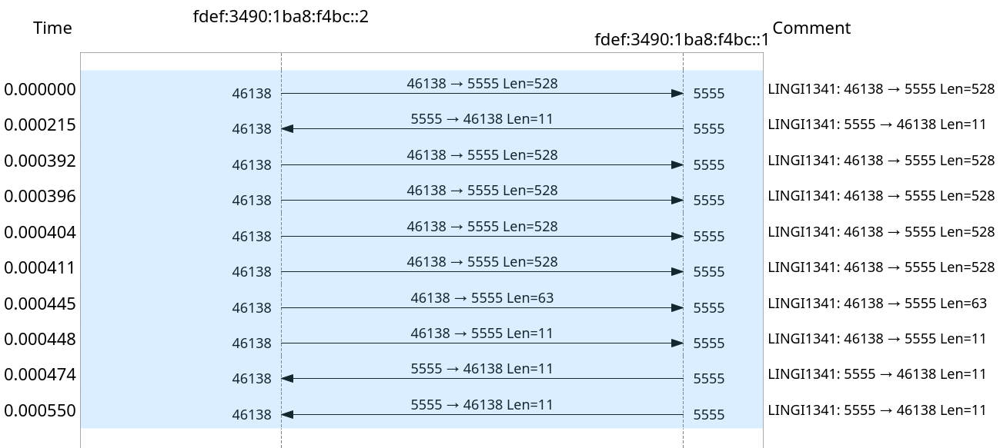

# TRTP2

## Authors

| Name                                 | NOMA           |
|--------------------------------------|----------------|
| <h3>Sébastien d'Herbais de Thun</h3> | **2875-16-00** |
| <h3>Thomas Heuschling</h3>           | **2887-16-00** |

## Project structure

The project structure is as follows :

- `base/` - the base implementation, instructions, etc. for the project
- `bin/` - the binary output files, normally empty, cleaned using `make clean`
- `headers/` - header definitions for the project
- `report/` - contains the LateX source code and resources for the report
- `src/` - contains the C source code of the project, `src/main.c` is the main function
- `tests/` - contains test definitions, best ran using `make clean && make test`
- `gitlog.stat` - required `git log --stat` output, generated using `make stat`
- `Makefile` - the make file
- `README.md` - informations about the project for the code review
- `rapport.pdf` - the required report in PDF format, generated using `make report`

## Makefile

- `all`: cleans and builds the code
- `clean`: deletes all build artifacts
- `release`: builds are release version (max optimization, no debug symbol)
- `build`: builds the code
- `run`: run the release version (**does not build**)
- `debug`: builds a version with debug symbols and no optimization
- `test`: builds & tests the code
- `stat`: generates gitlog.stat
- `install_tectonic`: installs the report builder, requires [cargo/rust](https://rust-lang.org)
- `report`: uses tectonic to build a PDF version (can take a **loooong** time the first time)
- `valgrind`: runs valgrind. Please read the valgrind section for details
- `helgrind`: runs helgrind. Please read the helgrind section for details
- `memcheck`: runs memcheck
- `callgrind`: runs callgrind in order to generate ca callgraph.
- `plot`: plots the callgraph into `callgraph.png`

## Command line arguments

Here is the printed usage for the application :

```
Multithreaded TRTP receiver.

Usage:
  ./receiver [options] <ip> <port>

Options:
  -m  Max. number of connection   [default: 100]
  -o  Output file format          [default: %d]
  -s  Enables sequential mode     [default: false]
  -N  Number of receiver threads  [default: 1]
  -n  Number of handler threads   [default: 2]
  -W  Maximum receive buffer      [default: 31]
  -w  Maximum window size         [default: 31]

Sequential:
  In sequential mode, only a single thread (the main thread) is used
  for the entire receiver. This means the parameters n & N will be
  ignored. Affinities are also ignored.
  Sequential mode comes with a huge performance penalty as the different
  components are ran sequentially while being designed for multithreaded use.

  /!\ You can expect about half the speed using sequential mode.

Affinities:
  Affinities are set using a affinity.cfg file in the
  working directory. This file should be formatted like this:
        comma separated affinity for each receiver. Count must match N
        comma separated affinity for each handler. Count must match n
  Here is an example file: (remove the tabs)
        0,1
        2,3,4,5
  It means the affinities of the receivers will be on CPU 0 & 1
  And the affinities of the handlers will be on CPU 2, 3, 4 & 5
  To learn more about affinity: https://en.wikipedia.org/wiki/Processor_affinity
```

## Objectives

As we already passed the project last year, we decided to restart from scratch but use our
previous knowledge to create a better and simpler implementation. In order to do this,
we decided to go with a better project structure made of simple, composable components
and assembled into larger functional units to reach the complete functionality required.

We also set some objectives for ourselves including, better performance, cleaner and
simpler code and no on-the-go allocations. These objectives are achieved in different
ways explained below.

### Better performance

We designed our architecture to have as high a performance as we can have while using
techniques available in the course and with limited dependencies. For this reason,
we implemented a near allocation free code that uses multithreading and SIMD to
dramatically improve the performance. Every buffer allocated is reused. We also try and
use limited mutexes and locks as those have a high latency associated with them.

We also used more advanced data structures such as hash tables to improve performance
by removing the need of iterative lookup by having an average execution speed of O(1).
We also use a stream to communicate allowing both the head and the tail to be manipulated
without having interlocks. The data structure used by the stream is a double-ended linked-list
removing the need for iterative operations once again.

### Cleaner & simpler code

The code is split into numerous small files containing single function units such as
the definition of a hash-table, packet related functions, etc. This makes reading,
debugging and working as a group easier. In addition, we have commented the entire
codebase with in-depth comments explaining he inner workings, inputs and outputs
of every function we defined.

## Architecture

TODO

## Callgraph

Here is the callgraph of the application showing the limitations caused by CRC 32


## Packet flow

Here is the transfer graph for a small transfer of a few KiB showing the use of `recvmmsg`.
